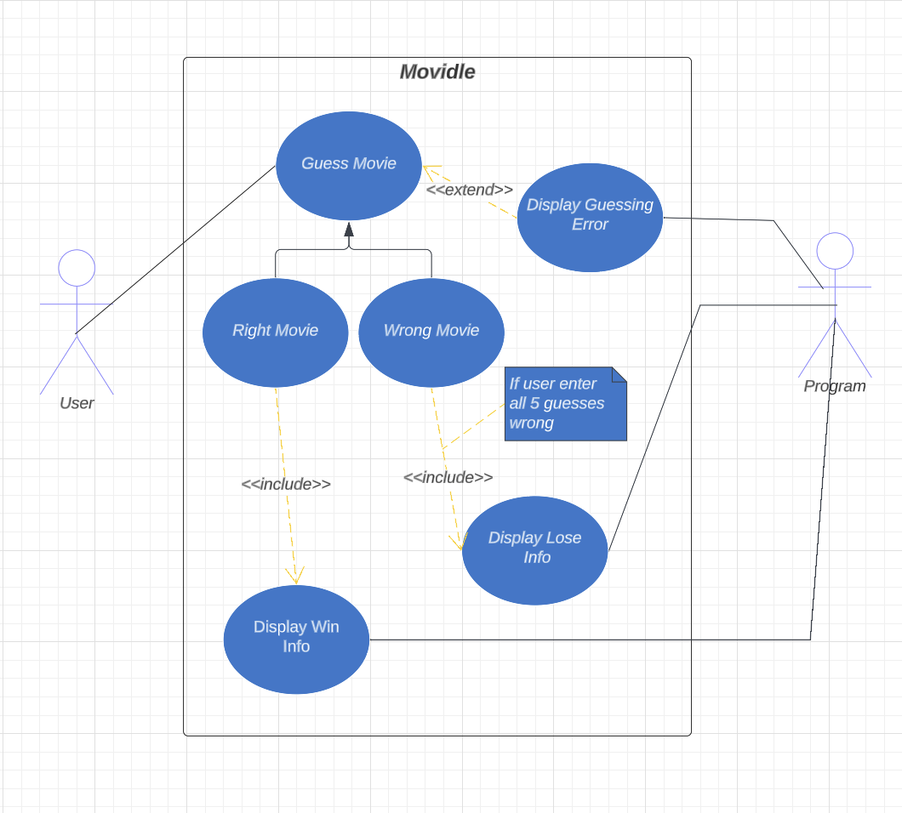

# Movidle


Movidle is a movie guessing game developed using JavaFX that challenges players to guess the correct movie title within five attempts. The game provides feedback after each guess in the form of colored tiles, revealing specific information about the movie such as year, genre, origin, director, and star. The objective is to correctly guess the movie title by using the feedback provided.

## Classes


```java
public class MovidleController implements Initializable {}
// lorem

public class MovidleApplication extends Application {}
// lorem

public class Movie {}
//

public class RandomMovie {}
//

public abstract class MagicSquare extends StackPane {}
// It is the base class of all the squares. 
// Most common properties exist here.
// Animation and label properties exist here.
// StackPane gets color value from abstract method.

public class GreenMagicSquare extends MagicSquare {}
// Overrides the getColor() method.
// Returns the green color value.

public class RedMagicSquare extends MagicSquare {}
// Overrides the getColor() method.
// Returns the red color value.

public abstract class ArrowMagicSquare extends RedMagicSquare {}
// It includes arrow image as an extra.
// Arrow image gets rotation value from abstract method.

public class UpArrowMagicSquare extends ArrowMagicSquare {}
// To rotate the arrow overrides the getRotationValue() from base.
// Return 0 value to make the arrow up.

public class DownArrowMagicSquare extends ArrowMagicSquare {}
// To rotate the arrow overrides the getRotationValue() from base.
// Return 180 value to make the arrow down.

public class AutoCompleteTextField extends TextField {}
// This class needs to get list of autocomplete resource.
// The list is an object(Suggestion) list.
// The resource is used to set menu items.
// There needs to be a menu to display suggestions.
// Menu is located bottom of the text field.
// Menu items title is inserted to field when select menu item.

public class VisualAutoCompleteTextField extends AutoCompleteTextField {}
// VisualSuggestion models class is needed for the resource.
// Menu items has image left of the title.
// Also images loading asynchronously to avoid to block the main thread.

public class MaxSizedContextMenu extends ContextMenu {}
// Resizing the menu with max size is needed.
// Context menu is resized when its event is showing.

public class Suggestion {}
// It is the model class that includes title for suggestion.
// This model class is used in list for autocomplete class.

public class VisualSuggestion extends Suggestion {}
// This model class is used in list for visual autocomplete class.
```
## Use Case Diagram

## UML Class Diagram

## Screenshots
<p align="center">
  
</p>
