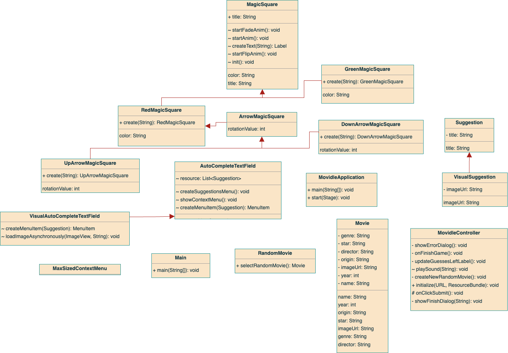

# Movidle


Movidle is a movie guessing game developed using JavaFX that challenges players to guess the correct movie title within five attempts. The game provides feedback after each guess in the form of colored tiles, revealing specific information about the movie such as year, genre, origin, director, and star. The objective is to correctly guess the movie title by using the feedback provided.

## Classes


```java
public class MovidleController implements Initializable {}
// lorem

public class MovidleApplication extends Application {}
// lorem

public class Movie {}
//

public class RandomMovie {}
//

public abstract class MagicSquare extends StackPane {}
//

public class GreenMagicSquare extends MagicSquare {}
//

public class RedMagicSquare extends MagicSquare {}
//

public abstract class ArrowMagicSquare extends RedMagicSquare {}
//

public class UpArrowMagicSquare extends ArrowMagicSquare {}
// 

public class DownArrowMagicSquare extends ArrowMagicSquare {}
//

public class AutoCompleteTextField extends TextField {}
//

public class VisualAutoCompleteTextField extends AutoCompleteTextField {}
//

public class MaxSizedContextMenu extends ContextMenu {}
//

public class Suggestion {}
//

public class VisualSuggestion extends Suggestion {}
//
```
## UML Class Diagram

## Screenshots
<p align="center">
  
</p>
